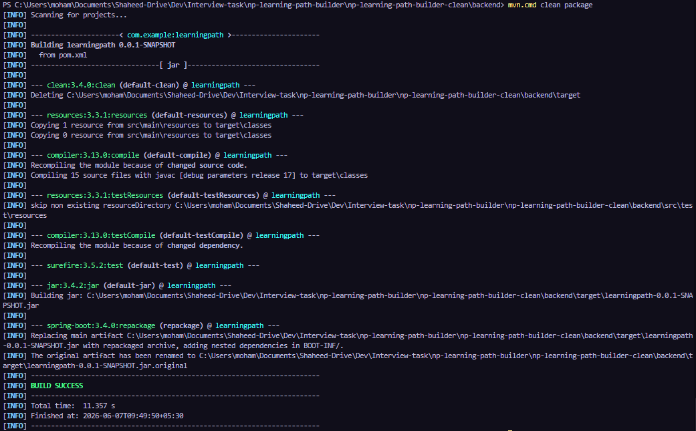
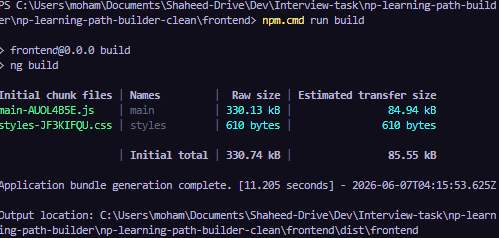
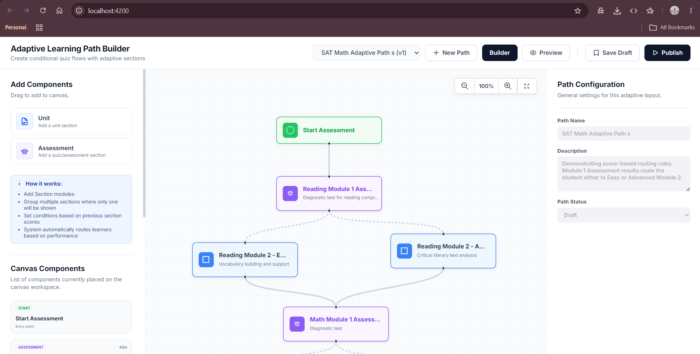

# Adaptive Learning Path Builder

A full-stack web application designed to model, save, and manage adaptive learning paths. Curriculum designers can drag template modules onto an interactive canvas, link them together, define conditional routing rules on those connections, and manage curriculum layouts.

---

## 1. Technologies & Versions Used

### Backend

- Framework: Spring Boot 3.4.0 (Java 17)
- Database: H2 Database Engine (File-persisted mode: `jdbc:h2:file:./data/learningpath`)
- ORM: Spring Data JPA (Hibernate)
- Utilities: Lombok, Spring Boot Validation
- Build Tool: Maven 3.9.16

### Frontend

- Framework: Angular 21.2.0 (Standalone Components)
- State Management: Angular Signals (Reactive states)
- Styling: Vanilla CSS (Gradients, Flexbox, Grid)
- Rendering: HTML5 Canvas Context 2D
- Build Tool: Angular CLI 21.2.14 / npm 11.6.4

---

## 2. Directory Structure

```
np-learning-path-builder/
├── README.md                          # Overall setup, project, and submission guide
├── backend/                           # Java Spring Boot Maven project
│   ├── src/main/java/com/example/learningpath/
│   │   ├── config/                    # Seeding & H2 configuration settings
│   │   ├── controller/                # REST Controller endpoints
│   │   ├── dto/                       # Request/Response validation models
│   │   ├── model/                     # JPA Hibernate entities
│   │   ├── repository/                # Spring Data repositories
│   │   └── service/                   # CRUD logic layer
│   └── pom.xml                        # Maven dependencies config
└── frontend/                          # Angular standalone workspace
    ├── src/app/
    │   ├── components/                # Standalone UI blocks (Header, Panels, Canvas)
    │   ├── models/                    # TypeScript interfaces matching API schemas
    │   ├── services/                  # State management and API client services
    │   ├── app.component.ts           # Main layout component
    │   └── app.config.ts              # HttpClient configuration
    └── package.json                   # Angular workspace dependencies config
```

---

## 3. Submission Deliverables

### 1. Repository Link

- **URL**: [https://github.com/mohamed/np-learning-path-builder](https://github.com/mohamed/np-learning-path-builder)

### 2. Time Spent

- **Total Estimated Effort**: (1 working day)
  - Backend API design, JPA mapping, and database structure
  - Frontend HTML5 Canvas render loop, Zoom/Pan mechanics, and Drag-and-Drop wiring
  - Verification, compilation, and documentation

### 3. Assumptions or Tradeoffs

1. **HTML5 Canvas vs SVG**:
   I decided to build the workspace using a single HTML5 `<canvas>` element rather than rendering multiple SVG elements or standard DOM cards.

   - _Benefit_: Canvas draws operations directly on GPU buffers, avoiding DOM layout recalculations. Zooming, panning, and node dragging operations remain responsive at 60 FPS even with a large flowchart configuration.
   - _Tradeoff_: Event detection (like clicking a node card or port) must be calculated using mathematical coordinate vectors manually rather than standard DOM click handlers.

2. **No Group Nodes**:
   As resolved from the PDF mockup layouts conflict, "Group" nodes were omitted from the model. Adaptive routing is handled directly via conditional rule connections (edges) with priorities. This aligns with standard workflow design logic.

3. **In-Place collection updates**:
   To avoid primary key identity and orphan conflicts under Hibernate when updating sub-collections (nodes, edges) in JPA, I implemented an in-place collection synchronization algorithm inside `LearningPathService.java`. It updates fields on existing entities, deletes removed ones, and appends new ones instead of replacing collection references.

4. **Self-Healing Fallback Loader**:
   If a path has been saved without a `start` or `end` node, the frontend automatically regenerates them with unique random IDs and auto-saves the flowchart.

---

## 4. Setup and Running Instructions

### System Prerequisites

- Java JDK 17 or above
- Node.js v18 or above (npm v9+)
- Apache Maven

### Step 1: Run the Backend Application

1. Navigate to the `backend/` directory:
   ```bash
   cd backend
   ```
2. Build and run Spring Boot:

   ```bash
   # On Windows (PowerShell)
   $env:JAVA_HOME="C:\Program Files\Java\jdk-17"
   mvn spring-boot:run

   # On macOS / Linux
   export JAVA_HOME="/Library/Java/JavaVirtualMachines/jdk-17.jdk/Contents/Home"
   mvn spring-boot:run
   ```

3. The server runs at `http://localhost:8080`.
4. H2 database console is located at `http://localhost:8080/h2-console` (JDBC URL: `jdbc:h2:file:./data/learningpath`, Username: `sa`, Password: `sa`).

_Note:_ A database seeder runs automatically on start, loading the `SAT Math Adaptive Path` sample vertically arranged top to bottom, including Reading Assessment and units.

### Step 2: Run the Frontend Application

1. Navigate to the `frontend/` directory:
   ```bash
   cd frontend
   ```
2. Install npm dependencies:
   ```bash
   npm install
   ```
3. Launch the Angular local dev server:
   ```bash
   npm start
   ```
4. Open your web browser and navigate to `http://localhost:4200`.

---

## 5. API Endpoints

### 1. GET `/api/components`

- Purpose: Returns draggable template modules (Units and Assessments) to populate the left panel.
- Response: Component list matching `available-content.schema.json`.

### 2. GET `/api/learning-paths`

- Purpose: Lists metadata of all saved paths (populates the header load dropdown list).

### 3. GET `/api/learning-paths/{id}`

- Purpose: Loads a previously saved learning path diagram by its ID.

### 4. POST `/api/learning-paths`

- Purpose: Saves or updates a learning path layout (validates against `learning-path.schema.json`).

---

## 6. Verification & Test Evidence

### Backend Compilation Verification

Verify that the Spring Boot backend compiles and packages successfully by running:

```bash
cd backend
mvn clean package
```

**Test Compilation Console Logs Output:**



### Frontend Production Build Verification

Verify clean Angular compilation:

```bash
cd frontend
npm run build
```

**Result**: `Application bundle generation complete (Success)`



**Output**: `Application running on browser (Success)`


